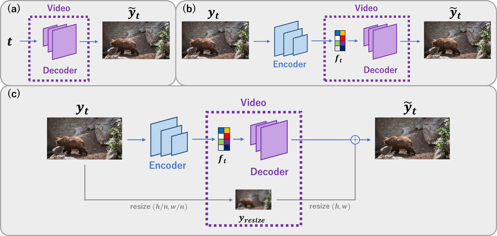
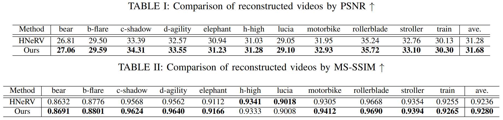
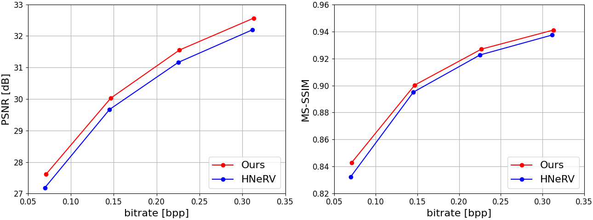

# Inplicit Neural Representations for Videos Based on Residual Connection
### [Paper] | [DAVIS Data](https://davischallenge.org/)

## Method overview
(a) NeRV, (b) HNeRV, (c) Proposed


## Get started
You can setup a conda environment:
```
git clone https://github.com/th359/RC-HNeRV.git
cd RC-HNeRV/
```
```
conda create -n rchnerv python=3.8
conda activate rchnerv
pip install -r requirements.txt
```

## Data Download
First, Create a data directory.
Download [DAVIS dataset](https://davischallenge.org/) and put under data directory.
```
RC-HNeRV/data/DAVIS-data
```

## Training and Evaluation
```
python run.py
```
The defalt parameter settings are as follows
```
epoch = 300
model_size_list = [0.5, 1.0, 1.5, 2.0]
size_n = 128
lr = 0.00099
```

## Result
### Comparison of reconstruced vidos


### Visualization of reconstruced vidos


### Video compression results


## Contact
If you have any questions, please feel free to email the authors: hayatai17@fuji.waseda.jp
